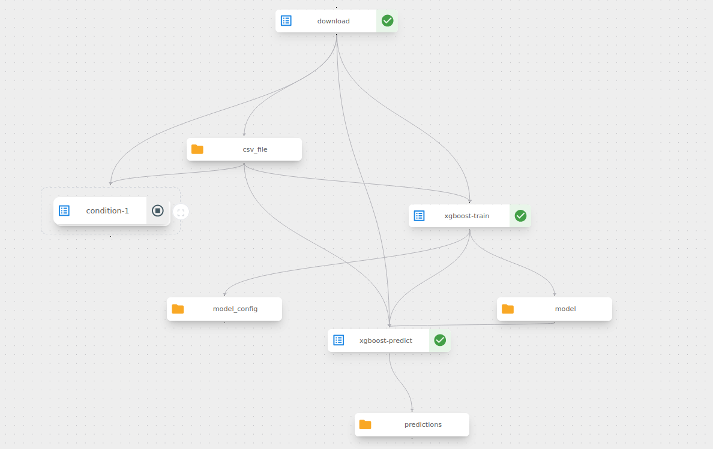

# MLOps with Kubefow

This repository provides an overview of [Kubeflow](https://www.kubeflow.org/) data platform. The Kubeflow version installed on the Kubernetes cluster is `1.9.0`. The Kubeflow components are located in `components`. Use `kubeflow-try.ipynb` to create and submit the pipeline into the Kubeflow cluster.  

# Pipeline

