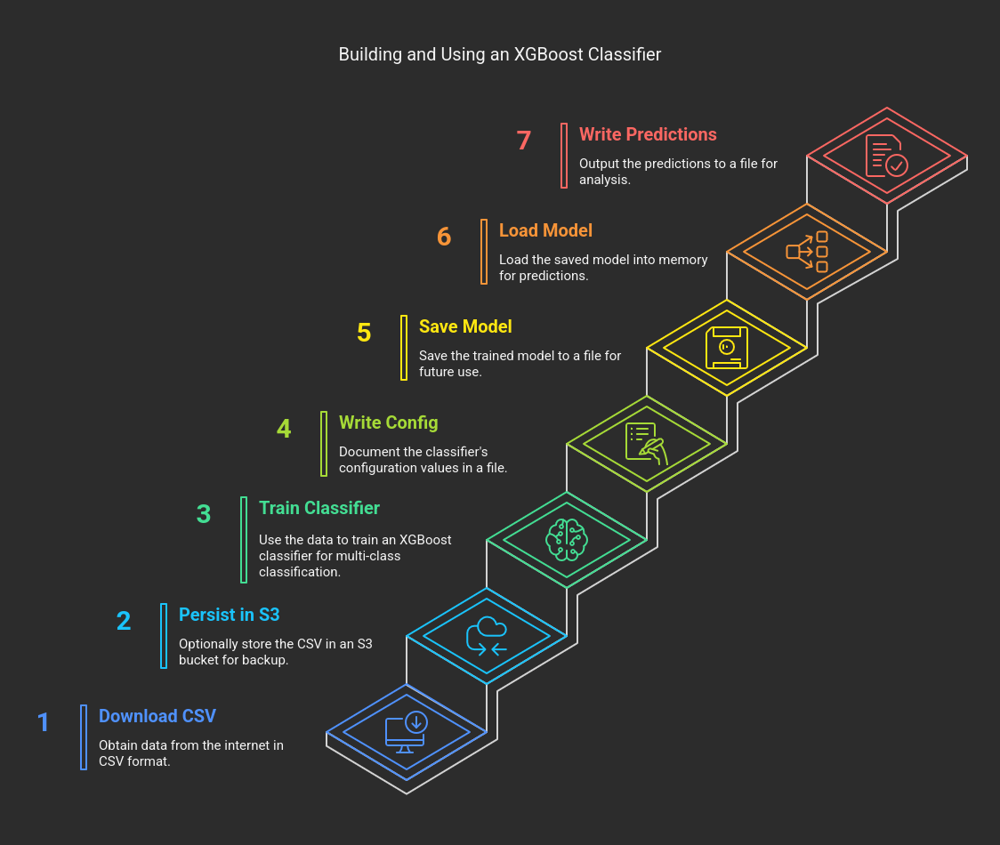

# MLOps with Kubeflow

This repository provides an overview of [Kubeflow](https://www.kubeflow.org/) data platform. The Kubeflow version installed on the Kubernetes cluster is `1.9.0`. The Kubeflow components are located in `components`. Use `kubeflow-try.ipynb` to create and submit the pipeline into the Kubeflow cluster.  

# Pipeline

# Infrastructure As Code

This project leverages `Terraform` to provision and manage infrastructure in two distinct environments: `staging` and `production`. You can find the environment-specific configurations under `terraform/providers/ionos-cloud/multiple-environments`. 

# CI/CD with GitHub Actions

A GitHub Actions workflow is included to automate the following tasks:

* Formatting: Ensures Terraform configuration files adhere to a standardized format.
* Validation: Performs syntax checks and validates configuration integrity.
* Deployment: Applies the Terraform configuration changes to the specified environment.

This CI/CD pipeline helps maintain consistent and reliable deployments across the two environments.